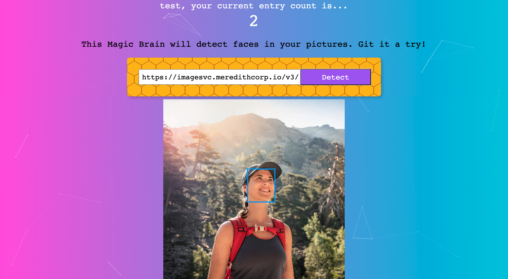
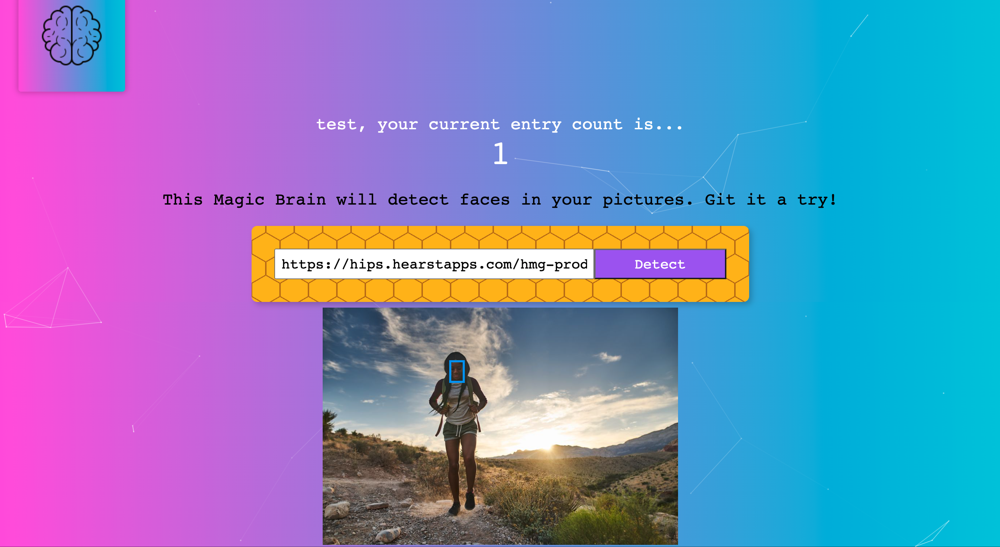

# Face Recognition Application - Smart Brain

Have fun to detect faces with our face recognition application! 

## Summary

This image recognition app using a Machine Learning API from Clarifai and allow users to register, log in and detect pictures from uploaded URLs.  

## Sample display

1. Click this link: https://smart-brain-yym.herokuapp.com/
2. Register first if you don’t have an account
3. Paste the URL to the white box
4. Click “Detect”

## Demo

## Want to build your own?

### Steps:

1. clone this repository
2. Run npm install
3. Run npm start
4. Enjoy!

